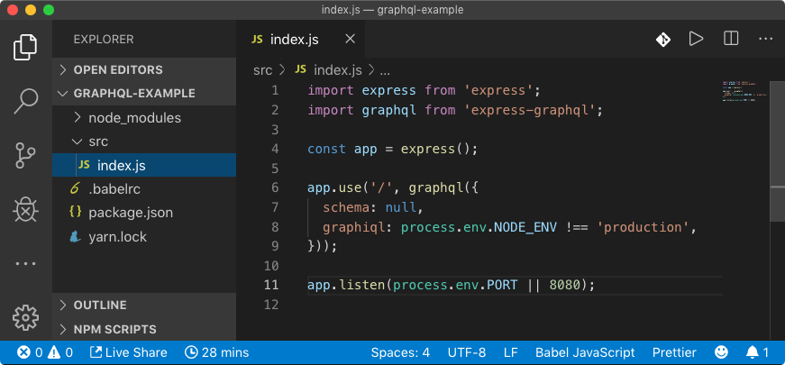

# Getting Started

## Step 1: Create a new Node.js project

During this step, you want to ensure that at least the following things are taken care of:

* You can use the latest \(modern\) JavaScript syntax \(most likely using [Babel](https://babeljs.io/) transpiler\)
* You can launch the app by running `yarn start` \(or, `npm run start`\) which is a commonly used convention.
* When you make changes to the source code, the app \(API\) automatically restarts \(see [Nodemon](https://github.com/remy/nodemon)\).



Assuming that you already have [**Node.js**](https://nodejs.org) and [**Yarn**](https://yarnpkg.com) \(or, NPM\) installed,  bootstrap a new Node.js project by running:

```bash
# Creates package.json file in the root of the project's folder
$ yarn init

# Installs Express.js and GraphQL.js NPM modules (runtime dependencies)
$ yarn add graphql express express-graphql

# Installs Nodemon and Babel (dev dependencies)
$ yarn add nodemon --dev
$ yarn add @babel/core @babel/cli @babel/node @babel/preset-env --dev --exact
```

Create `.babelrc` file, add `start` script to the `package.json` file:



```yaml
{
  "name": "api",
  "version": "1.0.0",
  "private": true,
  "dependencies": {
    "express": "^4.17.1",
    "express-graphql": "^0.9.0",
    "graphql": "^14.5.4"
  },
  "devDependencies": {
    "@babel/cli": "7.6.0",
    "@babel/core": "7.6.0",
    "@babel/node": "7.6.1",
    "@babel/preset-env": "7.6.0",
    "nodemon": "1.19.2"
  },
  "scripts": {
    "start": "nodemon src/index.js localhost 8080 --exec ./node_modules/.bin/babel-node"
  }
}
```



```yaml
{
  "presets": [
    "@babel/preset-env"
  ]
}
```




Note that the actual versions of all the listed dependencies may differ but it shouldn't  be a problem.


Finally, create `src/index.js` file that will serve as an entry point to the \([Express.js](http://expressjs.com/)\) app:

```javascript
import express from 'express';
import graphql from 'express-graphql';

const app = express();

app.use('/', graphql({
  schema: null,
  graphiql: process.env.NODE_ENV !== 'production',
}));

app.listen(process.env.PORT || 8080);
```

At this point, when you launch the app by running `yarn start` and navigate to `http://localhost:3000/` in the browser's window, you must be able to see the following: 



Congratulations! It means that this step is complete and we can move on to the next one, creating our first GraphQL schema.


## Step 2: Create a basic GraphQL schema

For starter, let's build a basic API running on [http://localhost:8080/](http://localhost:8080/) that would handle the following query:



```graphql
query {
  environment {
    arch
    platform
    uptime
  }
}
```



```javascript
{
  data: {
    environment": {
      arch: 'x64',
      platform: 'linux',
      uptime: 11.256
    }
  }
}
```













