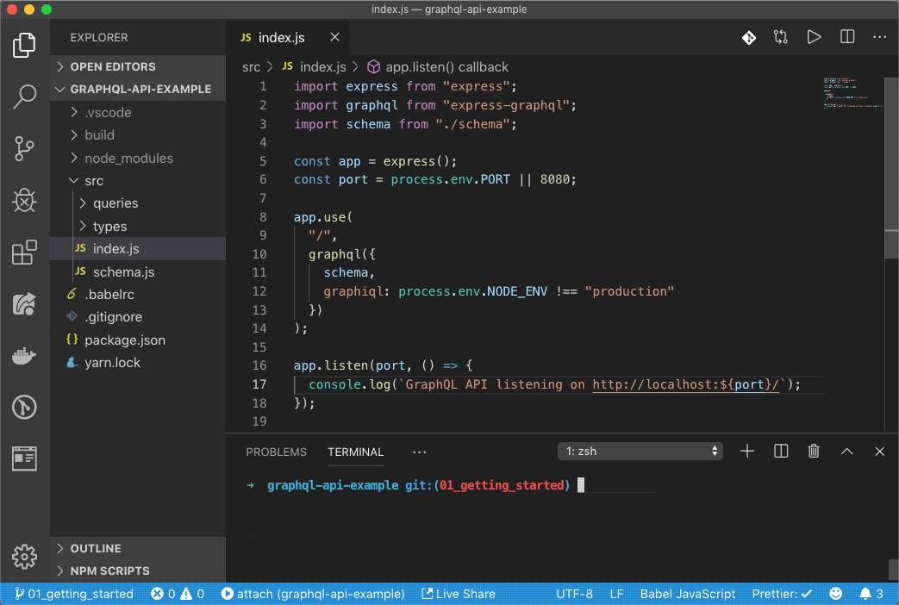
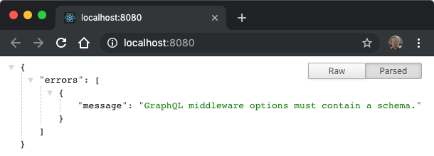
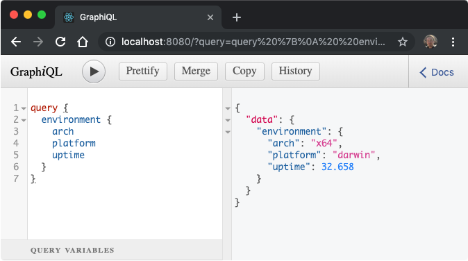
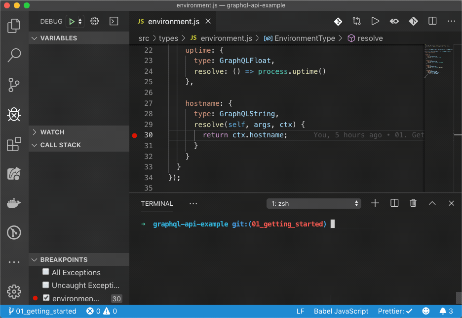

# 1. Getting Started

## Step 1: Create Node.js Project <a id="create-nodejs-project"></a>

During this step, you want to ensure that at least the following things are taken care of:

* You can use the latest \(modern\) JavaScript syntax \(most likely using [Babel](https://babeljs.io/) \)
* You can launch the app by running `yarn start`  which is a commonly used convention.
* When you make changes to the source code, the app \(API\) automatically restarts \(see [Nodemon](https://github.com/remy/nodemon)\).
* Node.js debugger is configured and ready to be used when needed.



Assuming that you already have [**Node.js**](https://nodejs.org) and [**Yarn**](https://yarnpkg.com) \(or, NPM\) installed,  bootstrap a new Node.js project by running:

```bash
# Creates package.json file in the root of the project's folder
$ yarn init

# Installs Express.js and GraphQL.js NPM modules (runtime dependencies)
$ yarn add graphql express express-graphql

# Installs Nodemon and Babel (dev dependencies)
$ yarn add nodemon @babel/core @babel/cli @babel/preset-env --dev
```

Create `.babelrc` file containing Babel configuration. Add `"start"` script to the `package.json` file:



```yaml
{
  "name": "api",
  "version": "1.0.0",
  "private": true,
  "dependencies": {
    "express": "^4.17.1",
    "express-graphql": "^0.9.0",
    "graphql": "^14.5.6"
  },
  "devDependencies": {
    "@babel/cli": "^7.6.0",
    "@babel/core": "^7.6.0",
    "@babel/preset-env": "^7.6.0",
    "nodemon": "^1.19.2"
  },
  "scripts": {
    "build": "babel src --out-dir build --source-maps=inline --delete-dir-on-start --copy-files --verbose",
    "start": "yarn build --watch & sleep 1 && nodemon --watch build build/index.js"
  }
}
```



```yaml
{
  "presets": [
    ["@babel/preset-env", { "targets": { "node": "10.15.3" } }]
  ]
}
```




Note that the actual versions of all the listed dependencies above may differ from what you would end up having in your `package.json` file, but it shouldn't  be a problem.


Finally, create `src/index.js` file that will serve as an entry point to the \([Express.js](http://expressjs.com/)\) app:


```javascript
import express from "express";
import graphql from "express-graphql";

const app = express();
const port = process.env.PORT || 8080;

app.use("/", graphql({
  schema: null, // TODO: Implement GraphQL schema
}));

app.listen(port, () => {
  console.log(`GraphQL API listening on http://localhost:${port}/`);
});
```


At this point, when you launch the app by running `yarn start` and navigate to `http://localhost:8080/` in the browser's window, you must be able to see the following: 




**Congratulations!** This means that the step \#1 is complete and we can move on to the next one — creating our first GraphQL schema required by the **`express-graphql`** middleware.


## Step 2: Create GraphQL Schema <a id="create-graphql-schema"></a>

Basically, you create an GraphQL API by describing the hierarchy \(schema\) of all the \(query\) fields and mutations that the API must support.

Imagine that we need to fetch some OS-related info from the server using this query:



```graphql
query {
  environment {
    arch
    platform
    uptime
  }
}
```



```javascript
{
  data: {
    environment: {
      arch: 'x64',
      platform: 'linux',
      uptime: 11.256
    }
  }
}
```



It's asking for `arch`, `platform`, and `uptime` values grouped under the top-level `envrionment` field.

For this particular API we would need to implement just one GraphQL type \(`Environment`\), and one top-level query field `environment`. But since, we're planning to add more types and query fields later on, it would be a good idea to group them under `src/types` and `src/queires`  folders. Plus, you would add `src/schema.js` file exporting the "schema" GraphQL object type.



In a real-world project, you may end-up having 50+ GraphQL types, depending how big is the project. Taking that into consideration, you may want to export related GraphQL types from the same file. For example, **`ProductType`** and **`ProductCategoryType`** declarations can be exported from the **`src/types/product.js`**file.


The `Environment` GraphQL type is going to list `arch`, `platform`, and `uptime` fields, alongside their types and `resolve()` methods:


```javascript
import { GraphQLObjectType, GraphQLString, GraphQLFloat } from "graphql";

export const EnvironmentType = new GraphQLObjectType({
  name: "Environment",

  fields: {
    arch: {
      type: GraphQLString,
      resolve: () => process.arch
    },

    platform: {
      type: GraphQLString,
      resolve: () => process.platform
    },

    uptime: {
      type: GraphQLFloat,
      resolve: () => process.uptime()
    }
  }
});
```


Whenever a certain field is requested by the client, the GraphQL API runtime would call the corresponding `resolve()` function that would return the actual value for that field. Note that these resolve methods can be async \(returning a `Promise`\).

For the **top-level fields**, like `environment` field in our example, we're going to introduce yet another convention ⁠— placing them in multiple files under the `src/queries` folder. In many cases, those top-level fields would contain large `resolve()` functions and most likely you won't like having all of them within the same file. So, the `environment` field is going to be exported from `src/queires/environment.js`:


```javascript
import { EnvironmentType } from "../types";

export const environment = {
  type: EnvironmentType,
  resolve: () => ({})
};
```


Note, that the field resolves to an empty object `{}`. If it would resolve to `null` or `undefined` the query traversal would stop right there, and the GraphQL query \(from the example above\) would resolve to:

```yaml
{
  "data": {
    "environment": null
  }
}
```

You would also need `src/queries/index.js` and `src/types/index.js` re-exporting everything from the sibling files:



```javascript
export * from './envrionment';
```



```javascript
export * from './environment';
```



The `environment` field declaration we just created is going to be used in the root GraphQL object type:


```javascript
import { GraphQLSchema, GraphQLObjectType } from "graphql";
import * as queries from "./queries";

export default new GraphQLSchema({
  query: new GraphQLObjectType({
    name: "Query",
    fields: {
      ...queries
    }
  })
});
```


Finally, we're going to pass this schema type to the `express-graphql` middleware inside `src/index.js` :


```javascript
import express from "express";
import graphql from "express-graphql";
import schema from "./schema";

const app = express();
const port = process.env.PORT || 8080;

app.use("/", graphql({
  schema,
  graphiql: process.env.NODE_ENV !== "production"
}));

app.listen(port, () => {
  console.log(`GraphQL API listening on http://localhost:${port}/`);
});
```


With all that in place, you must be able to test our first GraphQL query using _GraphiQL_ IDE that `express-graphql` middleware provides out of the box:



## Step 3: Create GraphQL Context <a id="create-graphql-context"></a>

Inside of the `resolve()` methods we would often need access to the \(request\) context data such the currently logged-in user, data loaders \(more on that later\), etc.

For this purpose, let's create `Context` class and pass it to the `express-graphql` middleware alongside the schema:


```javascript
export class Context {
  constructor(req) {
    this._req = req;
  }

  get user() {
    return this._req.user;
  }

  get hostname() {
    return this._req.hostname;
  }
}
```



```javascript
import express from "express";
import graphql from "express-graphql";
import schema from "./schema";
import { Context } from "./context";

const app = express();
const port = process.env.PORT || 8080;

app.use("/", graphql(req => ({
  schema,
  context: new Context(req),
  graphiql: process.env.NODE_ENV !== "production"
})));

app.listen(port, () => {
  console.log(`GraphQL API listening on http://localhost:${port}/`);
});
```


Just for quick demonstration, let's see how to use this context object inside of a `resolve()` method:


```javascript
import { GraphQLObjectType, GraphQLString, GraphQLFloat } from "graphql";

export const EnvironmentType = new GraphQLObjectType({
  name: "Environment",

  fields: {
    ...,
  
    hostname: {
      type: GraphQLString,
      resolve(self, args, ctx) {
        return ctx.hostname;
      }
    }
  }
});
```


## Step 4: Configure a Debugger <a id="configure-debugger"></a>

Sooner or later you may bump into a situation where you would need to debug your code. It would be wise to ensure that debugging is working OK, even before you actually need it. In case with VS Code, setting up the debugger takes just two simple steps:

* Pass `--insepect` argument to `nodemon`.
* Create a launch configuration that would attach to an existing Node.js process.

For the first step, you can copy and paste the `start` script inside of `package.json` file as follows:


```yaml
{
  ...,
  "scripts": {
    "build": "babel src --out-dir build --source-maps=inline --delete-dir-on-start --copy-files --verbose",
    "start": "yarn build --watch & sleep 1 && nodemon --watch build build/index.js",
    "debug": "yarn build --watch & sleep 1 && nodemon --inspect --watch build build/index.js"
  }
}
```


And then create `.vscode/launch.json` file instructing VS Code how it should launch the debugger:


```yaml
{
  "version": "0.2.0",
  "configurations": [
    {
      "type": "node",
      "request": "attach",
      "name": "Attach to Node.js",
      "processId": "${command:PickProcess}",
      "restart": true,
      "protocol": "inspector"
    }
  ]
}

```





The source code for this chapter is available on [GitHub](https://github.com/kriasoft/graphql-api-examples) and [CodeSandbox](https://codesandbox.io/s/graphql-44c20) \(live demo\).


